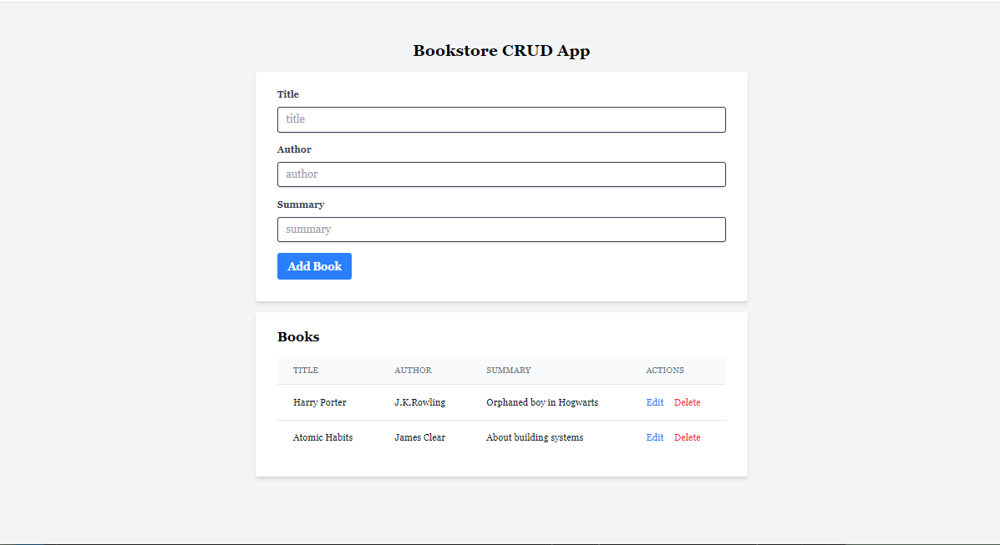

# Bookstore CRUD App

## Overview

A simple Bookstore CRUD (Create, Read, Update, Delete) application built with the **FARM stack** (FastAPI, ReactJS, MongoDB), styled using **TailwindCSS**.

## Features

- Add a new book with its title, author, and summary.
- View a list of all books in a table format.
- Edit existing book.
- Delete books.

## Tech Stack

- **Frontend**: ReactJS, TailwindCSS
- **Backend**: FastAPI
- **Database**: MongoDB (via MongoDB Atlas or local instance)
- **HTTP Client**: Axios

## Setup 

###	1. Backend (FastAPI)

####	Requirements

- Python 3.8+
- MongoDB (local or Atlas)
- [Uvicorn](https://www.uvicorn.org/), [FastAPI](https://fastapi.tiangolo.com/), [Motor](https://motor.readthedocs.io/en/stable/)

####	Installation

```bash
cd backend
pip install -r requirements.txt
```

#### Usage

1.  Run 
```bash
uvicorn main:app --reload
```
2.	The API will be live at: **http://localhost:8000**
3.	Go to **http://localhost:8000/docs** to test the API.

###	2. Frontend (ReactJS and TailwindCSS)

####	Installation

```bash
cd frontend
npm install
```

#### Usage

1. Run 
```bash
npm run dev.
```
2.	The Frontend will be live at: **http://localhost:5173**

## Screenshots

- Desktop View
  



## Contirbuting

Feel free to clone and fork this repository. You can also submit pull requests. Any contributions are welcome!

You are also free to customize it further to fit your needs! If you have any specific details you'd like to add or change, let me know.
